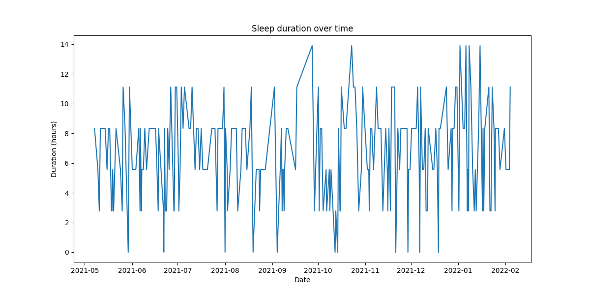
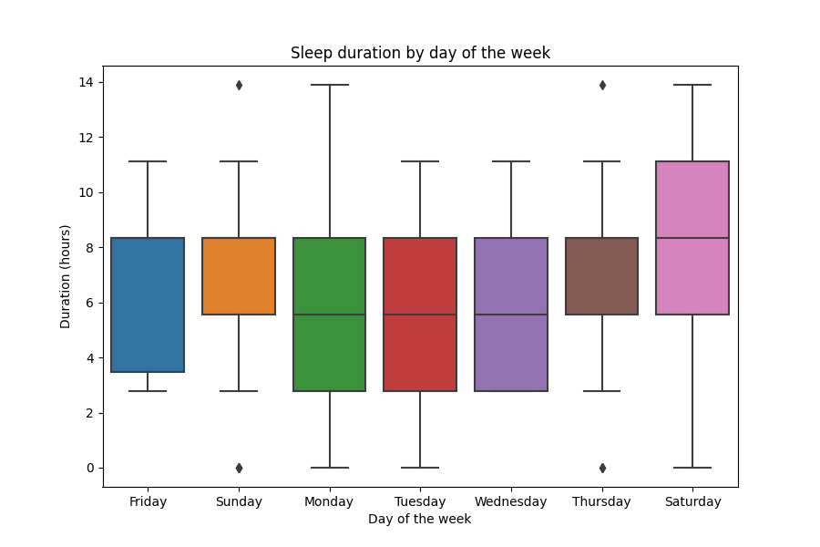
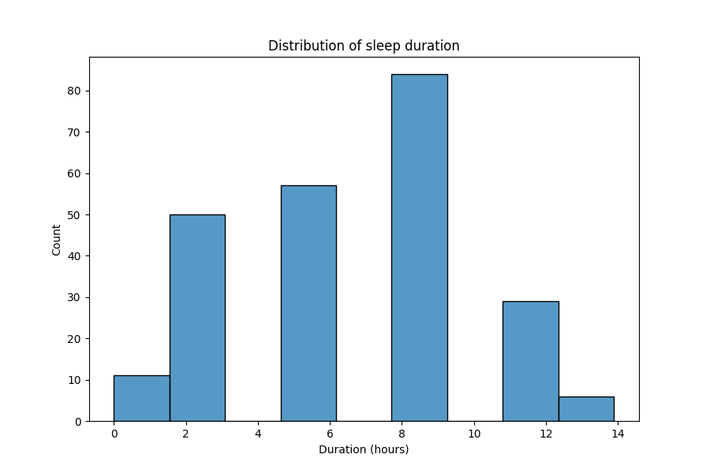

# Sleep Data Analysis Report

## Introduction

For this project, I downloaded my sleep data from Google Fit online and used the json file to generate different graphs to analyze my sleep patterns. The four types of graphs I chose were:

- Line plot: Sleep duration over time
- Box plot: Sleep duration by day
- Histogram: Sleep duration

In this report, I will present my findings and discuss any external factors that may be affecting my sleep patterns.

## Methodology

To conduct the analysis, I first downloaded my sleep data from Google Fit online as a json file. I then used Python to clean the data and generate the different graphs. The sleep duration data was cleaned by removing any entries with missing values or outliers. The sleep data was then split by day of the week and analyzed using the different graphs.

The four graphs used to analyze my sleep data are explained below:

1. Line plot: Sleep duration over time - This plot shows the trend of my sleep duration over time. It allows me to identify any long-term trends in my sleep patterns, such as changes in sleep duration over different seasons.

2. Box plot: Sleep duration by day - This plot shows the distribution of my sleep duration by day of the week. It allows me to identify any consistent patterns in my sleep duration, such as sleeping more on weekends.

3. Histogram: Sleep duration - This plot shows the frequency of different sleep durations. It allows me to identify the most common sleep duration and the distribution of sleep duration data.

## Findings

Based on the observations from the different graphs, it appears that I generally get between 4-8 hours of sleep per night, with occasional outliers where I sleep for longer periods of time. There is a consistent pattern of getting more sleep on Saturdays, with Sunday and Thursday also being relatively consistent days for sleep. The distribution of sleep durations appears to be negatively skewed, with the highest count of sleep durations at 8 hours, followed by 6 hours, 2 hours, and 11 hours. There is no clear correlation between bedtime and sleep duration, as indicated by the scatter plot.

## Discussion

External factors during this time period that may be affecting my sleep patterns could include depression, constant computer use, and a sedentary lifestyle. These factors can have a negative impact on sleep quality and duration, and may be contributing to the observed patterns in the data. It may be helpful to address these factors in order to improve sleep quality and duration.

## Conclusion

In conclusion, the analysis of my sleep data reveals some interesting patterns in my sleep patterns. By identifying the most common sleep duration and the distribution of sleep duration data, I can make informed decisions about my sleep habits and take steps to improve my sleep quality and duration.
